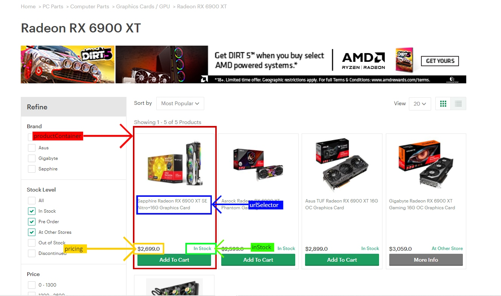

# StreetMerchant Extended
StreetMerchantExtended is a modified version of the [StreetMerchant library](https://github.com/jef/streetmerchant) which supports search pages with multiple products.

## Get started
The support for search pages works by adding a new property to the standard ``` .dotenv ``` file: ```USE_SEARCHPAGE```
If the property is set to ```false``` (it is by default) then the library will work just in the same way as the original version would; instead if it's set to ```true``` it will check the search pages' products. 
The rest of the library and ```.dotenv``` file work in the same way as the original (for example it supports discord/telegram integration and you can still use the same properties to filter for particular brands/series). 
## 1)  Add a search page
After cloning the project (```git clone https://github.com/MarcoNeriDev/StreetMerchantExtended.git```) for the first step of adding a search page to a store you will need to go to that store's file (located in ```src/store/model/```) and add a new object called ```searchPage``` and has this structure:
```
const store: Store = {
	...
	searchPage: {
		productContainer: ...
		urlSelector: ...
		pricing: ...
		inStock: ...
		products: ...,
	},
	...
}
```
This element will be used when ```USE_SEARCHPAGE``` is set to ```true``` instead of the store's links, the ```searchPage``` is optional, but if it's decided to support it, each of its fields will need to be defined:

* ### productContainer
	This field is needed to indentify each different product displayed in a search page, it's of type ```string``` and it will have to be the selector of an element of the page containing a single product.

- ### urlSelector
	This field is of type ```string``` as well and will need to be set as the ```a``` html 	element which contains a product's link to its page; this link will be compared to the 	store's links and if a match is found, it will be notified to the user.

- ### pricing
	This field is of the already existant ```Pricing```  type, ```euroFormat``` will have to be set to ```true``` or ```false``` whether the store uses Euros or not while the ```container``` field will need to be set as the selector of the HTML element containing the product price.

- ### inStock
	This field works in the same way as the store's ```inStock``` label, but it will have to be set instead to check whether a product in a search page is available or not.

- ### products
	This field is an array of ```SearchProduct``` (defined inside the ```src/store/model/store.ts``` file). Each of the array's items represent a single search page: the  ```searchPageUrl``` attribute will be set as the search page to analyze, while the ```series``` attribute will be the search page products' series (used when filtering the products). For each search page add a new searchProduct.

Examples of a store's ```searchPage``` working configuration:

This example is of the Euronics store support for search pages of sony ps4 and ps5 consoles
```
export  const  Euronics: Store  = {
	...
	searchPage: {
		productContainer: 'div.productCard',
		urlSelector: 'a[onClick]',
		pricing: {
			euroFormat: true,
			container: 'span.productCard__price',
		},
		inStock: {
			container: 'span.button__title--iconTxt',
			text: ['acquista online'],
		},
		products: [
			{
				series: 'sonyps5c',
				searchPageUrl: 'https://www.euronics.it/console/sony-computer/cat110087/?params=marca::sony+computer;piattaforma::ps5;',
			},
			{
				series: 'sonyps4c',
				searchPageUrl:'https://www.euronics.it/console/sony-computer/cat110087/params=marca::sony+computer;piattaforma::ps4;',
			},
		],
	},
	...
}
```
This second example is of the Umart store support for nvdia RTX 3070 and RX 6900 XT graphic cards
```
const  Umart: Store  = {
	...
	searchPage: {
		productContainer: '.goods_info',

		urlSelector: 'div.goods_name > a',

		pricing: {

			container: 'span[itemprop="price"]',
			euroFormat: false,
		},
		inStock: {
			container: '.goods_stock.graphik-bold',
			text: ['in stock'],
		},
		products: [
			{
				series: '3070',
				searchPageUrl: 'https://www.umart.com.au/Graphics-Cards---GPU_C.html?id=610&brand=1&price_min=&price_max=&filter=0&filter_attr=90285.0.0.0.0.0.0.0.0.0.0.0.0.0&mystock=1-6-7',
			},
			{
				series: 'rx6900xt',
				searchPageUrl: 'https://www.umart.com.au/Radeon-RX-6900-XT_1069C.html',
			},
		],
	},
	...
}
```

The following image will is an example of what corresponds to each ```searchPage``` field:



## 2) Add links
The second step to take in order to have full support of search pages is to add each search page product link to the already existing ```store.links```, because the library after checking a search page's products availability will try to find a match between the ```store.links``` and only if it is found, it will proceed to notifying the user; this step is taken in order to make sure no false positives can come through.

## 3) Start the bot
Finally after all the configuration the bot can be started (just as the original version) by the following command:
```
cd streetmerchant && npm i && npm run start
```
